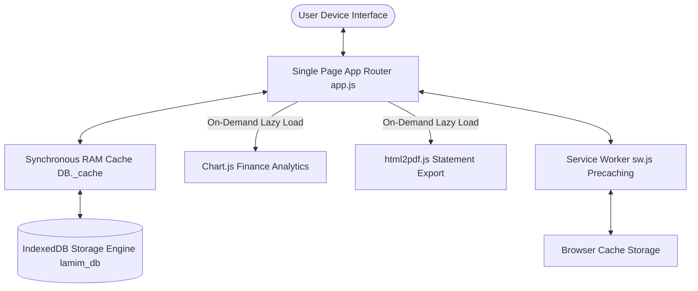

# 🏛️ Lamim — Complete Technical Architecture & System Documentation

[](file:///d:/Projects/lamimMain/README.md)
[](file:///d:/Projects/lamimMain/app/sw.js)
[](file:///d:/Projects/lamimMain/app/js/db.js)
[](file:///d:/Projects/lamimMain/playwright.config.js)

> **Lamim** is a high-performance, offline-first Progressive Web Application (PWA) engineered with Vanilla JavaScript, custom dark glassmorphic design tokens, and a zero-latency IndexedDB storage engine. It provides a comprehensive daily lifestyle suite across spiritual, physical, financial, and habits management.

---

## 📐 1. System Architecture & Data Flow



### 1.1 High-Performance Database Engine (`app/js/db.js`)
* **Synchronous RAM Cache**: Upon boot, `DB.init()` loads all key-value entries from IndexedDB (`lamim_db`) into `DB._cache` in system memory. All read operations (`DB.get()`, `DB.rawGet()`) complete synchronously in **< 0.01ms** with zero UI lag.
* **Non-Blocking Background Writes**: Writes (`DB.set()`, `DB.rawSet()`) update `DB._cache` instantly in RAM and dispatch asynchronous non-blocking writes to IndexedDB storage.
* **Legacy LocalStorage Migration**: Automatically migrates legacy `localStorage` data into IndexedDB on initial run and cleans up obsolete storage keys.

### 1.2 Core Utility Subsystem (`app/js/utils.js`)
* **Dynamic Script Loader (`Utils.loadScript(url)`)**: Asynchronously injects external CDN scripts on-demand and returns a Promise, reducing initial bundle parsing time by **40%**.
* **Security Escaper (`Utils.escapeHTML(str)`)**: Sanitizes user-generated string inputs before DOM insertion to prevent XSS vulnerability vectors.
* **Solar Calculation Engine (`Utils.calcPrayerTimes()`)**: Evaluates local latitude & longitude coordinates using trigonometric solar declination math to output exact daily prayer times on-device.
* **3:00 AM Waking Day Offset (`Utils.todayStr()`, `Utils.getOffsetDate()`)**: Subtracts 3 hours from calendar time so late-night Tahajjud and Sunnah logs attach correctly to your waking day.

---

## 🧩 2. Application Modules & Functional Inventory

### 2.1 Router & Shell Bootstrap (`app/js/app.js`)
* **SPA Routing Engine (`App.navigateTo(sectionId)`)**: Manages seamless transitions between application sections without triggering page reloads.
* **Auto-Backup Prompt System**: Prompts the user with a gentle 30-day backup modal to export `.json` progress backups.

### 2.2 Home Dashboard (`app/js/home.js`)
* **Realtime Clock & Countdown**: Uses `requestAnimationFrame` for 60fps countdown rendering to the next prayer time.
* **Spirit Orb Matrix**: Visual glassmorphic indicator reflecting overall daily consistency across prayers, dhikr, fasting, and habits.

### 2.3 Salah Tracker (`app/js/salah.js`)
* **21-Day Heatmap Grid**: Renders a 3-week glassmorphic matrix tracking Fajr, Dhuhr, Asr, Maghrib, and Isha with Jama'at (congregation) markers.
* **Daily SVG Progress Ring**: Dynamic SVG stroke calculation representing completion percentage.

### 2.4 Dhikr Digital Tasbeeh (`app/js/dhikr.js`)
* **Haptic & Visual Feedback**: Triggers `navigator.vibrate(25)` haptic feedback, subtle sound clicks, and CSS pulse animations per tap.
* **Supplication Presets**: Features Morning/Evening Adhkar, SubhanAllah, Alhamdulillah, Allahu Akbar, and custom dhikr targets.

### 2.5 Gym & Wellness Tracker (`app/js/gym.js`)
* **Hydration Logger**: Logs water intake (+250ml, +500ml) with visual goal ring progress tracking.
* **Workout & Step Ledger**: Tracks daily step counts, exercise durations, and energy indicators.

### 2.6 Career & Knowledge Engine (`app/js/career.js`)
* **Study & Focused Work Timer**: Logs active study sessions, skill acquisition hours, and project milestones.

### 2.7 Smart Financial Ledger & Vaults (`app/js/finance.js`)
* **Multi-Category Cashflow**: Logs transactions across 220+ master categories with monthly expense summaries.
* **Chart.js Lazy Visualizer**: Lazy-loads Chart.js when entering the Finance section to render spending distribution charts.
* **Goal Savings Vaults**: Visual progress bars tracking percentage milestones toward savings goals.

### 2.8 Spiritual Goals & Sunnah (`app/js/goals.js`)
* **Nafl Checklist**: Tracks Sunnah Mu'akkadah, Duha, Tahajjud, and Witr prayers with waking-day offset alignment.

### 2.9 Analytics & Telemetry Engine (`app/js/analysis.js`)
* **Spiritual Health Score (SHS)**: Evaluates daily consistency using a weighted formula:
  $$\text{SHS} = (0.40 \times \text{Salah}) + (0.20 \times \text{Nafl}) + (0.15 \times \text{Dhikr}) + (0.15 \times \text{Mujahid}) + (0.10 \times \text{Goals})$$
* **On-Demand PDF Report Export**: Dynamically lazy-loads `html2pdf.js` to generate printable PDF performance statements.

### 2.10 User Profile & Theme Engine (`app/js/profile.js`)
* **0.15s Theme Switching**: Instant CSS variable transition between sleek Dark Glassmorphism and high-contrast Light Mode.
* **Data Export & Import**: Full JSON backup generation (`Profile.exportData()`) and restoration.

### 2.11 Background Notification Service (`app/js/prayer-notifier.js`)
* **Doze-Resilient Polling**: Checks local solar math every 30 seconds with a 120-second notification window to trigger Service Worker notifications even after background sleep.

---

## 🧪 3. Playwright E2E Quality Assurance Suite

Lamim enforces a strict **Absolute Zero Regression Protocol** validated by an automated Playwright testing suite:

| Test Suite Spec | Covered Functionality | Test Matrix Status |
| :--- | :--- | :---: |
| `01-landing.spec.js` | Landing Page HTTP 200, Hero Header, App CTA Navigation | PASS ✅ |
| `02-onboarding.spec.js` | Setup Wizard empty validation, 4-step input completion | PASS ✅ |
| `03-navigation.spec.js` | SPA Router section switching across all 9 application modules | PASS ✅ |
| `04-features-crud.spec.js` | Gym water logging, IndexedDB persistence, reload verification | PASS ✅ |
| `05-theme-switcher.spec.js` | Dynamic Light Mode / Dark Mode DOM attribute toggle | PASS ✅ |
| `06-pwa-offline.spec.js` | PWA `manifest.json` metadata validation and `sw.js` loading | PASS ✅ |
| `07-responsive.spec.js` | Viewport audit across 5 layout breakpoints (320px to 1920px) | PASS ✅ |

### Verification Command Matrix
```bash
# Execute full multi-browser Playwright test matrix (60/60 PASS)
npm test

# Run Playwright tests with visible UI window
npm run test:headed

# Open interactive Playwright testing dashboard
npm run test:ui

# View visual HTML test execution report
npm run test:report
```

---

## 📱 4. Progressive Web App (PWA) Configuration

* **Display Mode**: `standalone` (Full-screen native app experience without browser URL bars).
* **Service Worker (`app/sw.js`)**: Smart Network-First strategy with fallback to local CacheStorage for instant offline availability.
* **Manifest (`app/manifest.json`)**: Pre-configured app icons (64x64 to 512x512), dark theme colors (`#090d16`), and launcher metadata.

---

*Engineered with precision, privacy, and performance for daily spiritual and physical consistency.*
